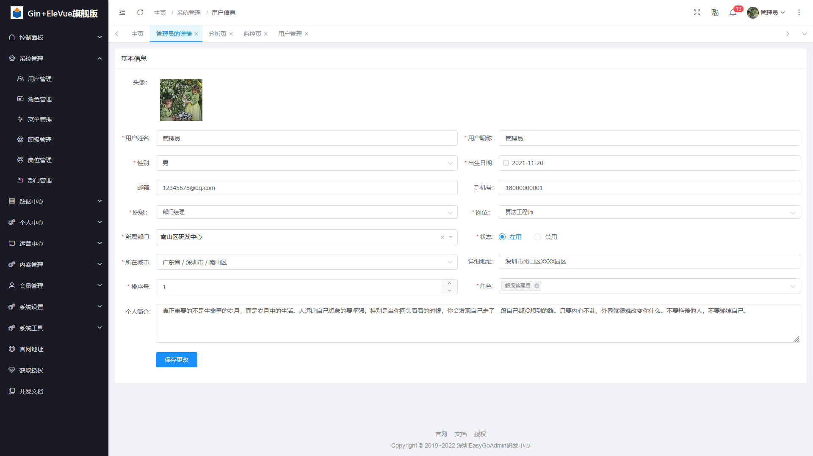
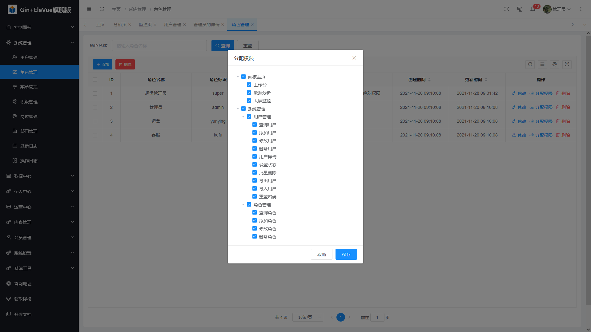
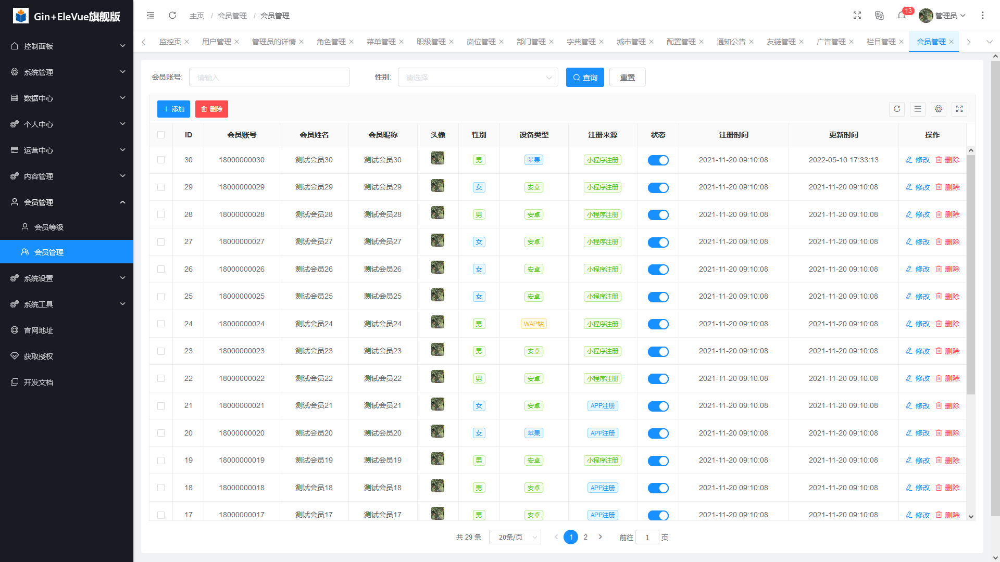

## 📚 项目介绍
一款 Go 语言基于Gin、Xorm、Vue、ElementUI、MySQL等框架精心打造的一款模块化、插件化、高性能的前后端分离架构敏捷开发框架，可快速搭建前后端分离后台管理系统，本着简化开发、提升开发效率的初衷，框架自研了一套个性化的组件，实现了可插拔的组件式开发方式，同时为了敏捷快速开发，框架特地集成了代码生成器，完全自主研发了自定义GO后端服务模板和前端Vue自定义模板，可以根据已建好的表结构，可以快速的一键生成整个模块的所有代码和增删改查等等功能业务，真正实现了低代码开发方式，极大的节省了人力成本的同时提高了开发效率，缩短了研发周期，是一款真正意义上实现组件化、可插拔式的敏捷开发框架。
## 🍻 项目特点

+ 模块化、松耦合
+ 模块丰富、开箱即用
+ 简洁易用、快速接入
+ 文档详尽、易于维护
+ 自顶向下、体系化设计
+ 统一框架、统一组件、降低选择成本
+ 开发规范、设计模式、代码分层模型
+ 强大便捷的开发工具链
+ 完善的本地中文化支持
+ 设计为团队及企业使用

## 🍪 内置模块
+ 用户管理：用于维护管理系统的用户，常规信息的维护与账号设置。
+ 角色管理：角色菜单管理与权限分配、设置角色所拥有的菜单权限。
+ 菜单管理：配置系统菜单，操作权限，按钮权限标识等。
+ 职级管理：主要管理用户担任的职级。
+ 岗位管理：主要管理用户担任的岗位。
+ 部门管理：主要管理系统组织架构，对组织架构进行统一管理维护。
+ 操作日志：系统正常操作日志记录和查询；系统异常信息日志记录和查询。
+ 登录日志：系统登录日志记录查询包含登录异常。
+ 字典管理：对系统中常用的较为固定的数据进行统一维护。
+ 配置管理：对系统的常规配置信息进行维护，网站配置管理功能进行统一维护。
+ 城市管理：统一对全国行政区划进行维护，对其他模块提供行政区划数据支撑。
+ 友链管理：对系统友情链接、合作伙伴等相关外链进行集成维护管理的模块。
+ 个人中心：主要是对当前登录用户的个人信息进行便捷修改的功能。
+ 广告管理：主要对各终端的广告数据进行管理维护。
+ 站点栏目：主要对大型系统网站等栏目进行划分和维护的模块。
+ 会员管理：对各终端注册的会员进行统一的查询与管理的模块。
+ 网站配置：对配置管理模块的数据源动态解析与统一维护管理的模块。
+ 通知公告：系统通知公告信息发布维护。
+ 代码生成：一键生成模块CRUD的功能，包括后端Go和前端Vue等相关代码。
+ 案例演示：常规代码生成器一键生成后的演示案例。

## 👷 开发者信息
* 系统名称：EasyGoAdmin敏捷开发框架Gin+EleVue版本
* 作者：半城风雨
* 作者QQ：[1260211623](http://wpa.qq.com/msgrd?v=3&amp;uin=1260211623&amp;site=qq&amp;menu=yes)
* 官网网址：[http://www.easygoadmin.vip/](http://easygoadmin.javaweb.vip/)
* 文档网址：[http://docs.gin.ele.easygoadmin.vip/](http://docs.gin.ele.easygoadmin.vip/)

## 🎨 系统演示

+ 演示地址：http://gin.ele.rxthink.cn

账号 | 密码| 操作权限
---|---|---
admin | 123456| 演示环境无法进行修改删除操作

## 👷 技术支持

[技术支持QQ：1260211623](http://wpa.qq.com/msgrd?v=3&amp;uin=1260211623&amp;site=qq&amp;menu=yes)

## 📌 版本说明
版本名称 | 版本说明 | 版本地址
---|---|---
GoFrame+Layui混编版 | 采用GoFrame、Layui等框架研发 | https://gitee.com/easygoadmin/EasyGoAdmin_GoFrame_Layui
Beego+Layui混编版 | 采用Beego、Layui等框架研发 | https://gitee.com/easygoadmin/EasyGoAdmin_Beego_Layui
Gin+Layui混编版 | 采用Gin、Layui等框架研发 | https://gitee.com/easygoadmin/EasyGoAdmin_Gin_Layui
Iris+Layui混编版 | 采用Iris、Layui等框架研发 | https://gitee.com/easygoadmin/EasyGoAdmin_Iris_Layui
GoFrame+EleVue前后端分离版 | 采用GoFrame、Vue、ElementUI等框架研发前后端分离版本 | https://gitee.com/easygoadmin/EasyGoAdmin_GoFrame_EleVue
Beego+EleVue前后端分离版 | 采用Beego、Vue、ElementUI等框架研发前后端分离版本 | https://gitee.com/easygoadmin/EasyGoAdmin_Beego_EleVue
Gin+EleVue前后端分离版 | 采用Gin、Vue、ElementUI等框架研发前后端分离版本 | https://gitee.com/easygoadmin/EasyGoAdmin_Gin_EleVue
Iris+EleVue前后端分离版 | 采用Iris、Vue、ElementUI等框架研发前后端分离版本 | https://gitee.com/easygoadmin/EasyGoAdmin_Iris_EleVue
GoFrame+AntdVue前后端分离版 | 采用GoFrame、Vue、AntDesign等框架研发前后端分离版本 | https://gitee.com/easygoadmin/EasyGoAdmin_GoFrame_AntdVue
Beego+AntdVue前后端分离版 | 采用Beego、Vue、AntDesign等框架研发前后端分离版本 | https://gitee.com/easygoadmin/EasyGoAdmin_Beego_AntdVue
Gin+AntdVue前后端分离版 | 采用Gin、Vue、AntDesign等框架研发前后端分离版本 | https://gitee.com/easygoadmin/EasyGoAdmin_Gin_AntdVue
Iris+AntdVue前后端分离版 | 采用Iris、Vue、AntDesign等框架研发前后端分离版本 | https://gitee.com/easygoadmin/EasyGoAdmin_Iris_AntdVue

## 🍪 项目结构

```
├── app             // 应用目录
│   ├── controller  // 控制器
│   ├── dao         // DAO层
│   ├── model       // 模型层
│   └── service     // 服务层
│   └── utils       // 系统工具
├── boot
├── config          // 系统配置
├── docker
├── document        // 文档目录
├── i18n            // 国际化
├── library         // 类库
├── packed
├── public          // 资源目录
├── router          // 路由
├── template        // 自定义模板
├── Dockerfile
├── go.mod
└── main.go
```

## 🔧 模块展示










## 🍻 贡献者名单

@半城风雨

## 🍻  安全&缺陷
如果你发现了一个安全漏洞或缺陷，请发送邮件到 easygoadmin@163.com,所有的安全漏洞都将及时得到解决。

## ✨  特别鸣谢
感谢[Gin](https://gin-gonic.com/)、[Xorm](https://xorm.io/)、[VueJs](https://cn.vuejs.org/)、[ElementUI](https://element.eleme.cn/#/)等优秀开源项目。

## 📚 版权信息

商业版使用需授权，未授权禁止恶意传播和用于商业用途，否则将追究相关人的法律责任。

本软件框架禁止任何单位和个人用于任何违法、侵害他人合法利益等恶意的行为，禁止用于任何违反我国法律法规的一切平台研发，任何单位和个人使用本软件框架用于产品研发而产生的任何意外、疏忽、合约毁坏、诽谤、版权或知识产权侵犯及其造成的损失 (包括但不限于直接、间接、附带或衍生的损失等)，本团队不承担任何法律责任。本软件框架只能用于公司和个人内部的法律所允许的合法合规的软件产品研发，详细声明内容请阅读《框架免责声明》附件；

本项目包含的第三方源码和二进制文件之版权信息另行标注。

版权所有Copyright © 2019~2021 easygoadmin.vip (http://www.easygoadmin.vip)

All rights reserved。

更多细节参阅 [LICENSE](LICENSE)